# Steps, logic, and/or decision-making process and diagram to interpret clue(hint) message

<!-- steps required to interpret the clue/hint's message - create a section steps using the following template: -->

## Steps to interpret clue(hint) message
<!-- create a list with syntax: step number. step description. -->
- step 1 
    - (do only for the first clue.)
    - try to identify the delimiter of the combination given in the clue.
    - make sure that if there is only one space after a number and the delimiter is not just a space, then the number is not a part of the combination.

- step 2
    - use the information obtained in step 0 to seperate the combinatoin and the clue/hint's message.
    
<!-- now come a sub-decision making prosess - to interpret the clue/hint's message -->

## A decision making diagram to interpret clue(hint) message
<!-- 
if first index of the message is a number, then skeip to step 6.

Step 1. Check if the first word of the message is a number written in words (e.g. one, two, three, etc.)
    - if yes, then repalce the word with the number.
    - if no, then skip to step 2.

Step 2. check if the first word is 'Nothing'
    - if yes, need to make sure if nothing is correct and go to step 3.5. 
    - if no, just keep going.

Step 3. if the first word is 'All'
    - if yes, skip to step 3.5. 
    - if no, then skip to step 4.

Step 3.5. check if it's all correct or all incorrect
    - if yes, then go to step 4.
    - if no, then go to step 4. 

Step 4. check if the second word is 'but' or 'except'
    - if either is in, go to step 5.
    - if neither is in, then go to step 6.

Step 5. check if the third word is a number written in words (e.g. one, two, three, etc.)
    - if yes, we will use the number of digits in the combo - the number in the third word as the number of digits in the combination, and then they will either be all correct or all incorrect.
    - if no, then skip to step 5.5

Step 5.5. output - problems and attempt to use step 6.
 
Step 6. check how many numbers are in the message - example of a message with 2 numbers '2.... 1....'
    - if 3 numbers, 
        - find max number 
            - for debug: if not at index 0
                - check if it's the first number that appears in the message
                    - if yes, print that the number is not at index 0 but it's the first number that appears in the message. -- no throw exception yet
                    - if no, print that the number is not at index 0 and it's not the first number that appears in the message. -- no throw exception yet
            - make sure the 2 other numbers add up to the max number
                - if yes, then max means the number of correct digits in the combination, and the other 2 numbers mean the number of digits that are correct and are correctly placed and the number of digits that are correct but are not correctly placed. now we need to identify which is which.
                    - for now, we will assume that the first number is the number of digits that are correct and are correctly placed and the second number is the number of digits that are correct but are not correctly placed.
                - if no, then throw exception.

use <pre>  to warp the text in the decision making diagram.
example: |maybe| E[<pre> A text that needs to be wrapped to another line </pre>  ];

-->

```mermaid
        graph TD;

        A[Is the first word a number written in words?] -->|yes| B[<pre> Replace the word with the number </pre>  ];
        C -->|yes| D[<pre> Need to make sure if nothing is correct. </pre>  ];
        C -->|no| E[<pre> Keep going. </pre>  ];
        B --> F[<pre> Is the first word 'Nothing'? </pre>  ];

        F -->|yes| G[<pre> Skip to step 3.5. </pre>  ];
        F -->|no| H[Skip to step 4.];
        G --> I[<pre> Is it all
        correct or all incorrect? </pre>  ];
        I -->|yes| J[<pre> Go to step 4. </pre>  ];
        I -->|no| K[<pre> Go to step 4. </pre>  ];
        H --> L[<pre> Is the second word 'but' or 'except'? </pre>  ];
        L -->|yes| M[<pre> Go to step 5. </pre>  ];
        L -->|no| N[<pre> Go to step 6. </pre>  ];
        M --> O[<pre> Is the third word a number written in words? </pre>  ];
        O -->|yes| P[<pre> We will use the number of digits in the combo - the number in the third word as the number of digits in the combination, and then they will either be all correct or all incorrect. </pre>  ];
        O -->|no| Q[<pre> Skip to step 5.5 </pre>  ];
        Q --> R[<pre> Output - problems and attempt to use step 6. </pre>  ];
        N --> S[<pre> How many numbers are in the message? </pre>  ];
        S -->|3| T[<pre> Find max number </pre>  ];
        T --> U[<pre> Is the max number at index 0? </pre>  ];
        U -->|yes| V[<pre> Is it the first number that appears in the message? </pre>  ];
        V -->|yes| W[<pre> Print that the number is not at index 0 but it's the first number that appears in the message. -- no throw exception yet </pre>  ];
        V -->|no| X[<pre> Print that the number is not at index 0 and it's not the first number that appears in the message. -- no throw exception yet </pre>  ];
        U -->|no| Y[<pre> Skip to step 6.5 </pre>  ];
        Y --> Z[<pre> Output - problems and attempt to use step 6. </pre>  ];
        S -->|2| AA[<pre> Find max number </pre>  ];
        AA --> AB[<pre> Is the max number at index 0? </pre>  ];
        AB -->|yes| AC[<pre> Is it the first number that appears in the message? </pre>  ];
        AC -->|yes| AD[<pre> Print that the number is not at index 0 but it's the first number that appears in the message. -- no throw exception yet </pre>  ];
        AC -->|no| AE[<pre> Print that the number is not at index 0 and it's not the first number that appears in the message. -- no throw exception yet </pre>  ];
        AB -->|no| AF[<pre> Skip to step 6.5 </pre>  ];
        AF --> AG[<pre> Output - problems and attempt to use step 6. </pre>  ];
        S -->|1| AH[<pre> Find max number </pre>  ];
        AH --> AI[<pre> Is the max number at index 0? </pre>  ];
        AI -->|yes| AJ[<pre> Is it the first number that appears in the message? </pre>  ];
        AJ -->|yes| AK[<pre> Print that the number is not at index 0 but it's the first number that appears in the message. -- no throw exception yet </pre>  ];
        AJ -->|no| AL[<pre> Print that the number is not at index 0 and it's not the first number that appears in the message. -- no throw exception yet </pre>  ];
        AI -->|no| AM[<pre> Skip to step 6.5 </pre>  ];
        AM --> AN[<pre> Output - problems and attempt to use step 6. </pre>  ];
```

